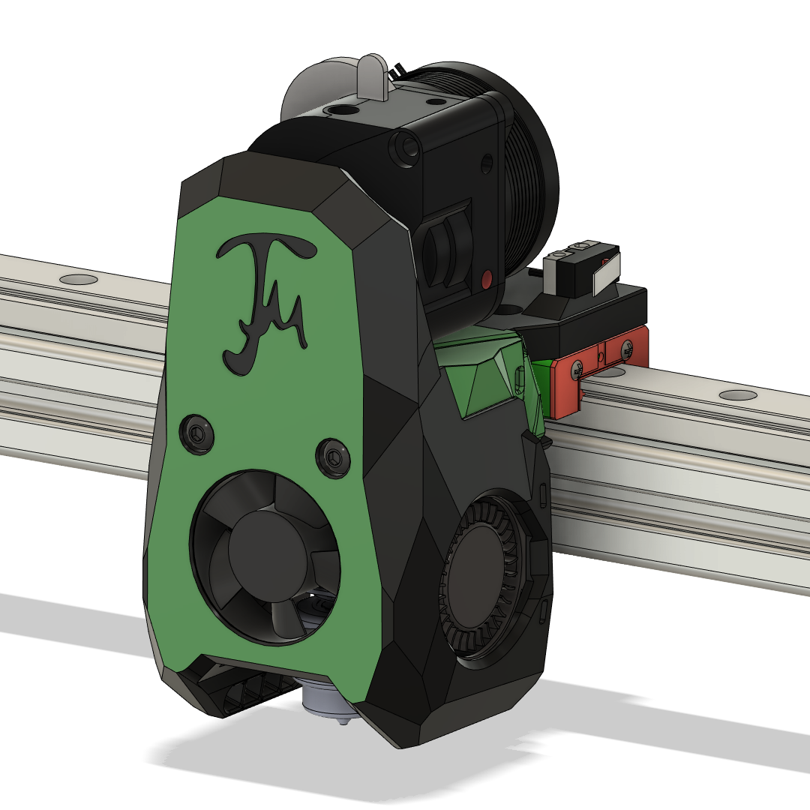

# Tiny-M_SSB_1010
Smol Stealthburner Toolhead for Tiny-M

# This is a combination of different mods to adapt the Smol Stealthburner to the Tiny-M. 

 <a href="https://discord.com/channels/825469421346226226/909858082841067591/951228478278230057"/> Original Smol Stealthburner 1010 by Maverick on the Doomcube Discord.</a> The 1010 version uses a 3010 hotend fan, instead of the common 3007 fan from the Voron 0.1 toolheads. Tiny-M carriage is based on <a href="https://github.com/flyespresso/antpower/tree/main/SMOL%20Stealth%20Burner%20MGN9C%20V0%20Gantry%20Mod"> flypower's MGN9C Carriage mod for the SSB.</a>

Maverick's previous SSB version repo <a href= "https://github.com/PrintersForAnts/Crucible/tree/main/Smol%20Stealth%20Burner"> can be found here. </a>

I have printed the SSB 1010 to verify fitment of parts, but it has not actually extruded any filament yet. 

**Print and use at your own caution.**

#Change Log

- **2022-11-08**
	- Added Sherpa Extruder support for Dragon and Revo Voron Adapters.
	- Replaced Adapter_Dragon STL with new version.
	- Removed MGN12 carriage for original Dragon Adapter.
	- Added separate STEP file for just the toolhead with updates.

# Assembly Notes

The fan shroud has wire routing for the hot end and part cooling fans. The SSB was designed with QD elctrical connections for the fans, but you can just run the wires if you don't want the added expense. I mounted two Wago 221s on the back side of the fan shroud for ease of future maitenance.

This toolhead **is shorter than the original Tiny-M V4 toolhead.** That means you must verify your Z axis leadscrew is long enough to raise the bed far enough for the nozzle to trigger the z endstop. Your leadscrew nut should also be mounted on the bottom of your leadscrew nut mount (on the bed carriage), instead of on top of the leadscrew nut mount (like I had it before). Belted Z Tiny-M owners, you're in uncharted waters. Let me know how it goes.

I'm using an extended X axis endstop as a left over from my previous toolhead. I've left in the CAD here as I've verified that the SSB carriage triggers it correctly. The Original X-endstop block may work with the SSB carriage, but you will have to test it out yourself.